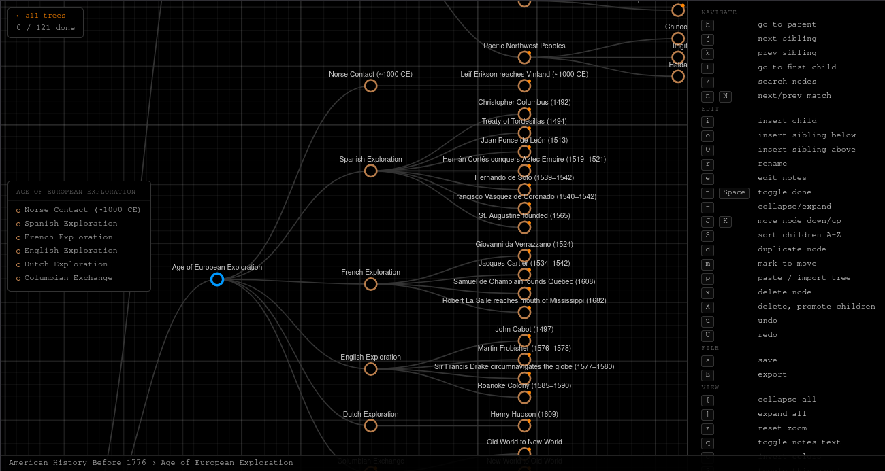

## Overview

Roadmaps is a browser-based interactive tree editor for building and tracking
hierarchical plans. A Go backend serves a D3.js frontend where trees are edited
entirely with keyboard shortcuts. Each roadmap is stored as a JSON file on the
server and can be exported as plain text, Markdown, or JSON.

The editor uses vim-style navigation (`hjkl`) to move between nodes and exposes
a full set of editing commands for inserting, renaming, deleting, duplicating,
and reordering nodes. Nodes can be marked done and a live progress counter
shows how many items are complete across the whole tree.

<p align="center">
  
</p>

## Features

- Interactive tree visualization powered by D3.js
- Vim-style keyboard navigation (`hjkl`)
- Node operations: insert child, insert sibling, rename, duplicate, delete, promote children
- Cut-and-paste to move nodes anywhere in the tree
- Mark nodes done with progress tracking across the whole tree
- Per-node notes with optional inline display
- Collapse and expand subtrees; collapse/expand all
- Incremental search with match cycling (`/`, `n`, `N`)
- Undo and redo (up to 100 levels)
- Sort children alphabetically
- Import from indented plain text or JSON; upload from file
- Export as plain text, Markdown checklist, or JSON
- Dark mode toggle
- Breadcrumb navigation bar and children sidebar panel
- Multiple roadmaps with a management page for create, rename, and delete

## Keybindings

| Key | Action |
|-----|--------|
| `h` | Go to parent |
| `j` | Next sibling |
| `k` | Previous sibling |
| `l` | Go to first child |
| `/` | Open search |
| `n` / `N` | Next / previous match |
| `i` | Insert child |
| `o` / `O` | Insert sibling below / above |
| `r` | Rename node |
| `e` | Edit notes |
| `t` / `Space` | Toggle done |
| `-` | Collapse / expand |
| `J` / `K` | Move node down / up |
| `S` | Sort children A–Z |
| `d` | Duplicate node |
| `m` | Mark node for move |
| `p` | Paste / import tree |
| `x` | Delete node |
| `X` | Delete node, promote children |
| `u` / `U` | Undo / redo |
| `s` | Save |
| `E` | Export |
| `[` / `]` | Collapse all / expand all |
| `z` | Reset zoom |
| `q` | Toggle notes display |
| `c` | Invert colors (dark mode) |
| `?` | Toggle keybindings panel |

## Usage

```
go run main.go [-port <port>]
```

The server defaults to port `1235`. Set the `PORT` environment variable to
override. Navigate to `http://localhost:1235` to manage your roadmaps.

Open a specific tree directly with:

```
http://localhost:1235/?id=my-roadmap
```

## Dependencies

```
go
```

The frontend loads D3.js from a CDN at runtime; no build step is required.

## License

This work is licensed under the GNU General Public License version 3 (GPLv3).

[](https://www.gnu.org/licenses/gpl-3.0.en.html)
